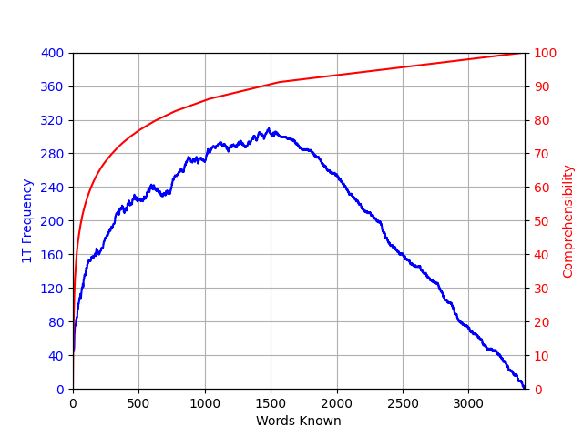

# Empyrical
> Gathering empricial data on the process of immersion learning.

Empyrical is a set of Python scripts used for mining empirical data on immersion learning. The project is broken into multiple scripts that compute different types of data. Over time, more scripts will be added, and more functionality to current scripts will be added, allowing a more detailed look at the process of immersion learning through data.

The current scripts are:

- **Hill1t**: At each stage of the immersion learning process, how much does one know, and how much is there to learn? Hill1t ("Hill it") measures this. Using a large amount of text, it will compute at each step of the process of sentence mining through the text. That is, how much a reader would understand ("Comprehensibility") and how much there is to learn ("1T Frequency"). The result is a rough estimate of how much learning opportunity there is at each step of learning a text. Below is an image of what this information looks like for a collection of 40 news articles.



## Installation

Create and activate a Python virtual environment:

```sh
py -m venv venv
./venv/scripts/activate
```

Install dependencies:

```sh
pip install -r requirements.txt
```

You will additionally need to [install a spacy model](https://spacy.io/models/) and retrieve some text in the language of instance (e.g. from [OANC](https://anc.org/)).

## Usage

Set the configuration in `config.json` and run the appropriate script.

## Release History

* 0.0.1
    * ADD: Add `Initial commit for Hill1t`

## Contributing

1. Fork it (<https://github.com/refold-languages/community-projects/fork>)
2. Create your feature branch (`git checkout -b feature/fooBar`)
3. Commit your changes (`git commit -am 'Add some fooBar'`)
4. Push to the branch (`git push origin feature/fooBar`)
5. Create a new Pull Request
